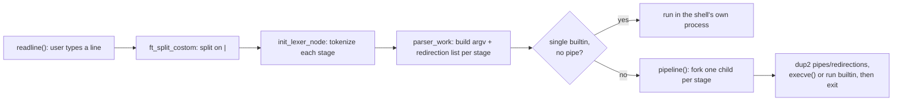
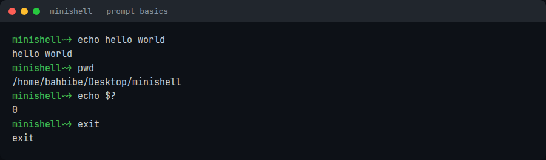
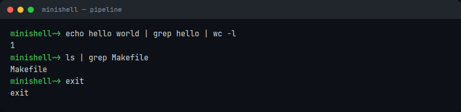
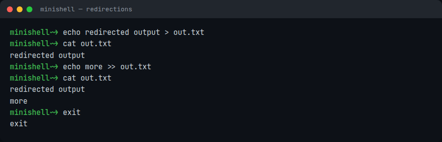
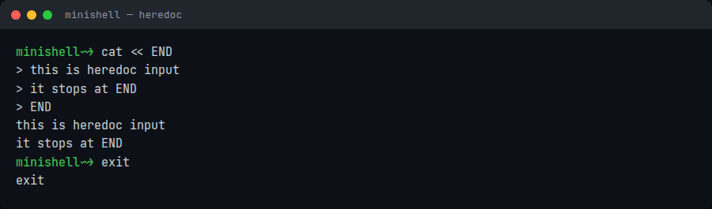

*This project has been created as part of the 42 curriculum by bahbibe, ybel-hac.*

# minishell


A Bash-like shell written from scratch in C: its own tokenizer, its own pipeline
scheduler, its own `fork`/`pipe`/`execve` process handling, no shell library used.

## Quick start

```sh
sudo apt install libreadline-dev   # Debian/Ubuntu, skip on macOS (see below)
git clone git@github.com:bahbibe/minishell.git
cd minishell
make
./minishell
```

On macOS the Makefile auto-detects the platform and wires up Homebrew's `readline`
(`brew install readline` first). Verified end to end: clean clone to a running prompt
in under 5 seconds.

```
minishell~> echo hello world | grep hello
hello world
minishell~> export NAME=42
minishell~> echo "hi $NAME"
hi 42
minishell~> exit
```

## How it works



## Features

- Interactive prompt with command history (readline).
- Executable lookup via `PATH`, or a relative/absolute path.
- Single (`'`) and double (`"`) quotes, with `$` expansion still active inside
  double quotes.
- `$VAR` and `$?` expansion.
- Redirections: `<`, `>`, `>>`, and heredoc (`<<`).
- Pipes (`|`), chaining any number of commands.
- `ctrl-C`, `ctrl-D`, `ctrl-\` behave like in Bash (new prompt, exit shell, ignored).
- Builtins: `echo -n`, `cd` (relative/absolute, `cd -`), `pwd`, `export`, `unset`,
  `env`, `exit`.

## Notable bits

- **Everything is hand-rolled.** ~2,700 lines of C, 18 of them a small hand-rolled
  string/memory library (`ft_split`, `ft_itoa`, `get_next_line`, ...), because the
  project rules ban most of libc. No parser generator, no readline alternative logic,
  no shell library.
- **Pipelines are a real fork chain.** `pipeline()` walks the parsed command list and
  forks one child per stage, wiring each one's stdin/stdout to the previous/next pipe
  with `dup2`, so `a | b | c | d` runs as four real processes, same as Bash.
- **One global, by design, with a caveat.** The subject requires at most one global
  variable, and only for the last signal number, so a signal handler can never touch
  shell state directly. This project uses one global, but it's a struct holding the
  parsed command list, the environment, and fd state, not just a signal number. That
  was a working, defended design choice; it doesn't match the subject's stricter rule.
- **Ported to Linux after being built for macOS.** The Makefile, a couple of headers,
  and one tokenizer function needed fixing to build and run correctly outside macOS,
  including an unsequenced-evaluation bug that silently corrupted every parsed command
  under GCC while working fine under Clang. See commit history for the specifics.

## Screenshots

| What it shows | |
|---|---|
| Prompt, `echo`, `pwd` |  |
| Pipe chain |  |
| Redirections (`>`, `>>`, `<`) |  |
| Heredoc |  |

## Resources

- [Bash Reference Manual](https://www.gnu.org/software/bash/manual/bash.html)
- [GNU Readline Library manual](https://tiswww.case.edu/php/chet/readline/rltop.html)
- `man` pages for `fork`, `execve`, `pipe`, `dup2`, `wait`, `signal`.

### AI usage

The mandatory implementation (parsing, execution, builtins) was written and defended
without AI assistance. AI (Claude) was later used, after the project had already been
evaluated, for a scoped code-review and portability pass: fixing macOS-only build
issues (a macro clash with readline's own headers, a missing `<stdint.h>` include, a
hardcoded Homebrew path, `-fno-common` breaking the project's single global across
translation units), fixing an unsequenced-evaluation bug that corrupted tokenization
under GCC, fixing a few file-descriptor/memory leaks and an invalid `close(-1)` found
with `valgrind --track-fds=yes`, and fixing a stdout-buffering bug that broke output
redirection when the shell's own stdout wasn't a terminal. Also used for this README
and the repo's release/screenshot pass. All changes were reviewed and tested manually
before being kept.
